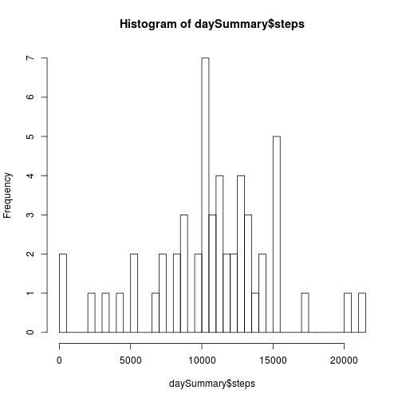
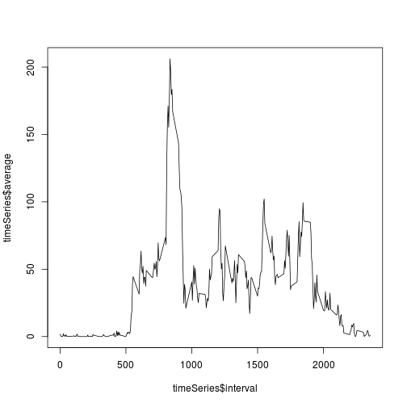
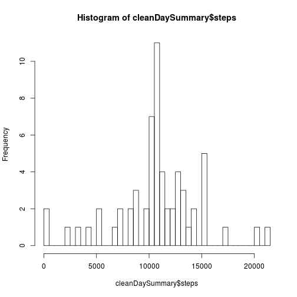
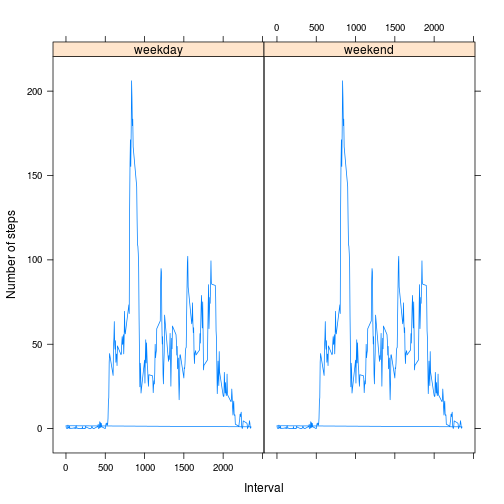

## Loading and preprocessing the data


```r
library(dplyr)
library(lattice)
data <- read.csv("activity.csv")
```


## What is mean total number of steps taken per day?

1. In the calculations below, daySummary$steps represents total number of steps taken per day.

2. The histogram below plots the frequencies of total number of steps taken each day, broken down into 50 bins.


```r
daySummary <- data %>% 
  group_by(date) %>% 
  summarize(steps = sum(steps))
hist(daySummary$steps, breaks = 50)
```

 


3. The mean of the total number of steps taken per day is 10766.19. The median is 10765.


```r
mean(daySummary$steps, na.rm=TRUE)
```

```
## [1] 10766.19
```

```r
median(daySummary$steps, na.rm=TRUE)
```

```
## [1] 10765
```


## What is the average daily activity pattern?

1. The graph below is a time series plot of the 5-minute interval (x-axis) and the average number of steps taken, averaged across all days (y-axis).


```r
timeSeries <- data %>% 
  group_by(interval) %>% 
  summarize(average = mean(steps, na.rm=TRUE))
plot(x = timeSeries$interval, y = timeSeries$average, type = "l")
```

 


2. On average across all the days in the dataset, interval #835 contains the maximum number of steps.


```r
timeSeries$interval[timeSeries$average == max(timeSeries$average)]
```

```
## [1] 835
```


## Imputing missing values

1. There are 2304 rows with missing values in the original data set.


```r
missing <- is.na(data$steps)
sum(missing)
```

```
## [1] 2304
```


2. In the clean data set below, missing values were replaced with the mean of the appropriate 5-minute interval.

3. The cleanData object below is equal to the original dataset but with the missing data filled in.


```r
cleanData <- data %>% 
  group_by(interval) %>% 
  mutate(average = mean(steps, na.rm=TRUE))
cleanData$steps[which(missing)] <- cleanData$average[which(missing)]
```


4. The histogram below plots the total number of steps taken each day, calculated from the clean data set. The mean and median total number of steps taken per day do not differ significantly from the estimates calculated earlier using the raw data set.


```r
cleanDaySummary <- cleanData %>% 
    group_by(date) %>% 
    summarize(steps = sum(steps))
hist(cleanDaySummary$steps, breaks = 50)
```

 

```r
mean(cleanDaySummary$steps)
```

```
## [1] 10766.19
```

```r
median(cleanDaySummary$steps)
```

```
## [1] 10766.19
```


## Are there differences in activity patterns between weekdays and weekends?

1. In the dataset below, cleanData$day is a new factor variable with two levels – “weekday” and “weekend” indicating whether a given date is a weekday or weekend day.


```r
# Set locale to make sure the names of weekdays are rendered in English
Sys.setlocale(category = "LC_ALL", locale = "en_US.UTF-8")
```

```
## [1] "LC_CTYPE=en_US.UTF-8;LC_NUMERIC=C;LC_TIME=en_US.UTF-8;LC_COLLATE=en_US.UTF-8;LC_MONETARY=en_US.UTF-8;LC_MESSAGES=nl_NL.UTF-8;LC_PAPER=nl_NL.UTF-8;LC_NAME=C;LC_ADDRESS=C;LC_TELEPHONE=C;LC_MEASUREMENT=nl_NL.UTF-8;LC_IDENTIFICATION=C"
```

```r
days <- as.factor(weekdays(as.Date(cleanData$date)))
weekendIndices <- days == "Saturday" | days == "Sunday"
cleanData$day <- as.factor(ifelse(weekendIndices, "weekend", "weekday"))
```


2. The panel plot below depicts a time series of the 5-minute interval (x-axis) and the average number of steps taken, averaged across all weekday days or weekend days (y-axis).


```r
cleanData <- group_by(cleanData, day)
p <- xyplot(average ~ interval | day,
            data = cleanData,
            type = "l",
            ylab = "Number of steps", xlab = "Interval")
print(p)
```

 
